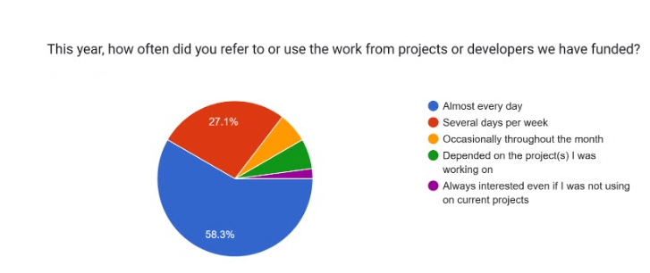
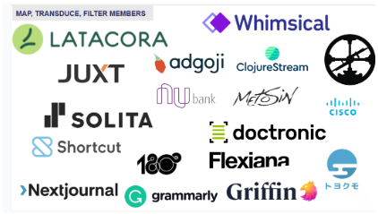

As 2024 comes to a close we want to reach out and thank you for supporting Clojure, open-source, and the Clojurists Together community.  

#### We’ve been able to accomplish a lot this year with your support.  

In 2024, we funded a total of $254,000 of projects. 17 developers completed 22 shorter-term projects ($110,000 USD). 8 developers received a monthly stipend for the year ($144,000 USD in long-term funding). Since 2018, Clojurists Together has awarded more than $1.1 million to 86 developers working on more than 142 projects.  

Your input on our quarterly surveys is critical to ensuring that we are funding work that is needed, valued, and adopted by the community at large. 26% of members participate every quarter.  

33% of members participated in the new process for selecting the developers to receive 2025 annual funding. Thank you for reviewing the proposals and voting!  

We appreciate your subscription to our regular news and updates dispatches - as we believe it encourages wider use of the tools and resources of the developers we have funded - strengthening and advancing the open-source and Clojure community. For those of you who subscribe but are not yet members, [you can always join the voting community for as little as $5 per month.](https://www.clojuriststogether.org/developers/)  

We were able to sponsor and attend the Heart of Clojure conference in Belgium in September - and it was a pleasure to talk with many of you again in person after a long CoVid hiatus.  

 
#### The developer’s work we fund is highly valued - and used daily.  

In addition to requesting specific tools and improvements, we have heard a consistent call for better documentation (content, presentation, and organization) and more support for engaging and supporting new Clojure users. This year, we received and funded several proposals that focused on these needs and will continue to encourage work in these areas.  

 

 

#### Short-Term Projects Funded in 2024  

**Q1 2024:** CIDER, clojure-lsp, Instaparse, Jank, scicloj, sitefox, UnifyBio, Wolframite  

**Q2 2024:** Clj-kondo, babashka, SCI, nbb, squint/cherry, Clj-merge tool, compojure-api, Enjure, Jank, Lost in Lambduhhs podcast, Plexus  

**Q3 2024:** clj-Nix, Clojure Goes Fast, Jank, Kushi, Malli, ScioCloj, Standard Clojure Style  

**2024 developers receiving annual funding:** Bozhidar Batsov, Michiel Borkent, Thomas Heller, Kira McLean, Nikita Prokopov, Tommi Reiman, Peter Taoussanis, Toby Crawley.  
 

#### Fun Facts and Thank You's  
We are truly an international group bringing a wide range of experience. From Q1 2022 to Q3 2024, we funded developers working in 20 countries including Austria, Belgium, Brazil, Bulgaria, Canada, Denmark, England, Finland, France, Germany, Israel, Lithuania, Netherlands, Norway, Poland, Serbia, Spain, Sweden, UK and the US.  

 
**This staggering amount of work has benefited our members and the broader Clojurist community.**  
 A thanks goes out to all the developers for their commitment and contributions to the community over the last 7 years: Adam Helins, Alexander Oloo, Ambrose Bonnaire-Sergeant, Arne Brasseur, Ashima Panjwani, Baptiste Dupuch, Benjamin Kamphaus, Ben Brinckerhoff, Bobbi Tower, Bozhidar Batsov, Brandon Ringe, Bruce Hauman, Chris Badahdah, Chris McCormick, Charles Comstock, Chris Oakman, Christian Johansen, Christophe Grand, Dainius Jocas, Daniel Higginbotham, Daniel Slutsky,Danny Freeman, David Levy, David Nolen, Dragan Duric, Eric Dallo, Ethan Miller, Gert Goet, Grodziski, Henry Widd, Iizuka Masashi, Isaac Johnston, Jack Rusher, Jacob O’Bryant, James Reeves, Janet Carr, Jeaye Wilkerson, Jeremiah Coyle, John Collins, John Stevenson, Joakim Tengstrand, Joel Holdbrooks, José Luis Lafuente, Juho Teperi, Karol Wójcik, Kira McLean, Konrad Kühne, Kury Harringer, L. Jordan Miller, Lee Hinman, Lukas Domagala, Mark Engelberg, Martin Kavalar, Matthew Davidson, Matthew Huebert, Matthew Ratzke, Michael Sappler, Michiel Borkent, Mike Fikes, Mitesh Shah, Nikita Prokopov, Oleksandr Yakushev, Oleksii Kachaiev, Oliver Caldwell, Othman Azil, Peter Stromberg, Peter Taoussanis, Rafael Krzyważnia, Sam Ritchie, Savo Djuric, Sean Corfield, Sebastian Zartner, Thomas Clark, Thomas Heller, Tim Pope, Toby Crawley, Tommi Jalkanen, Tommi Reiman, VEMV, Vladislav Protsenko, William Acton, Zach Oakes, Žygis Medelis, and the team at Gaiwan.  

Finally, a shout-out to the companies and organizations who have supported our work throughout the year and most for many years. They believe in Open Source development and have made a commitment to Clojure as an important tool for their product, service, and organizational projects. If your company might consider becoming a sponsoring member, please contact Daniel Compton at daniel@clojuriststogether.org to explore further.   

**And a shout out to the Into, Cons and Assoc Members who Contributed in 2024!**  
bevuta IT GmbH, QA Wolf, Inc, Jepsen, Xcoo, Sharetribe, Halal Booking, Basil, Cognician, Biotz SL, Matrix Operations, Strategic Blue, Eric Normand, Nubizzi, Bloom Ventures, Mastodon C, Ardoq AS, Condense, Mediquest, Vane GmbH, Codesmith GmbH, ELiT Ltd. Thorax informatieprojecten & advies, Fern Flower Labs, Joshua Miller and Revenue Share member Jacek Schae (Learn Reagent, Learn re-frame).    

**... and another thank you to all the 2024 Contributing Members.** [All of you make this work possible!](https://www.clojuriststogether.org/members/)  

Let’s join in celebrating this wonderful community - and hoping for peace in the New Year.   
lvh, Maria, Daniel, Heather, Felix, Max, and Lorelai (Clojurists Together Board), Kathy (Program Manager).  

