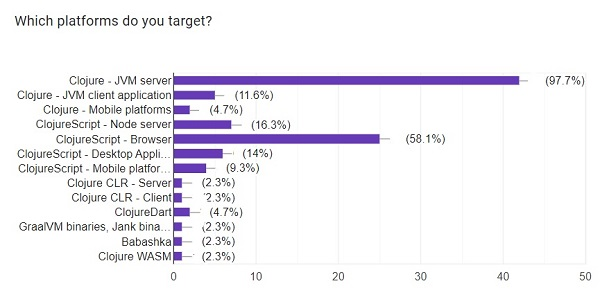
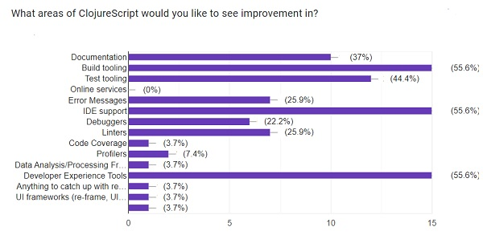

---
title: "Call for Proposals. November 2023 Member Survey"
date: 2023-11-04T08:30:00+08:00
summary: "We have $44K for Q1 2024 Projects"
author: Kathy Davis
draft: True

---  
 

## Call for Proposals. What project ideas have you been thinking about lately?
Clojurists Together is pleased to announce that we are opening our Q1 2024 funding round for Clojure Open Source Projects. Applications are open until the 24th of November 2023 (midnight Pacific Time). We are looking forward to reviewing your proposals! [Complete information and the Application can be found here!](https://clojuriststogether.org/open-source/)

We will be awarding a total of $44,000 USD for 8 projects – 4 projects at $2,000 each and 4 projects at $9,000 each. The $2k funding tier is for experimental projects or smaller proposals, whereas the $9k tier is for those that are more established. Projects generally run 3 months, however, the $9K projects can run between 3 and 12 months as needed. We expect projects to start on January 1, 2024.  

We recently surveyed our members to find out what types of initiatives they would like us to focus on for this round of funding. Their responses are summarized below.  Thanks as always – it is extremely helpful in ensuring that the community is a vital source of input.  

If you are working on a Clojure open source project or have a new one in mind, especially one mentioned as a focus area for our members, please consider applying. Or if you know someone that might like to apply, please pass this information along.  

## Our Members Speak: Feedback from the October/November 2023 Survey.  

## What areas of the Clojure and ClojureScript ecosystem need support?
### Production-Grade Documentation and Libraries
•	Documentation and tooling are still abysmal across the board.  
•	More Clojure (not ClojureScript) oriented server-side libraries and tools  
•	Documentation is something that could be extended; the official references sometimes can be cryptic when you're googling for something. A more verbose manual would be helpful.  

### More Users, Increased Beginner Adoption  
•	Evangelism, bringing in new developers  
•	Better new user onboarding, simpler initial setup  
•	Beginner learning material and outreach to other communities outside of the Clojure and ClojureScript community  
•	Community building and events  
•	Make Clojure CLI (deps.edn) easier to digest. I get the feeling that I should be an expert before using it. Lein with all its shortcomings, just gets you 90% of the way without you having to learn the tool. It just works. I still don't understand the difference between clj and Clojure (why are both needed) and can never remember the difference between -X -A -T -M and whatnot.  

### Frameworks, Tools, and Functions. Ensure relevancy in the eco-system.
•	Improving linters and test frameworks. the windows instructions on how to install clojure to get more people in ("An early release version of clj on Windows is available at.." has been the state since forever)?  
•	I think it's time for a Rails-/Django-/Phoenix- like framework :-) Maybe more companies would jump in and use the language. I know it's a difficult thing to balance because if *I* were to build it I'd base it on Hiccup, HTMX, HoneySQL and Component but the community likes to reinvent the Component library a lot. That would also not cover the database layer that well.  
•	I would love to see improved support for primitive math operations. I'm constantly vexed by boxed loop variables.  
•	I would just generally say I find the experimental ClojureScript work Michiel Borkent is doing to be heading in a very interesting direction and would love to see it continue to be supported.  
•	Tooling and testing  
•	I would like to get the "feel" that Clojure is modern. I many areas it feels like it has entered the 21st century.  
•	I feel like I am using xargs or sed for which I can never remember the arguments and have look them up again and again."  
•	The core language itself should be shored up: there are too many open bugs  
•	Anything that keeps Clojure/Clojurescript viable as a full stack ecosystem.  
•	Libs and tools around Datomic. Emacs IDEs which are not CIDER.  
o	IDE support, java 21 support  
•	Default MVC framework  
•	cljdart seems strategically important, and nativeimage perhaps  
•	Errors, async (for cljs)  
•	Squint   

### Data Science, AI  
•	Several general comments – no additional detail.  
•	Small data analysis tooling, things like fancy pattern matching, specter, meander &c
•	Big data, web development  

## What areas of the Clojure and ClojureScript ecosystem are strong? (compilation)  
•	Stability, ability to use non-Clojure libraries via interop, I don't have to upgrade my build tooling every 3 weeks. Dev. Experience.  
•	Core library and frameworks, available libraries.  Both Clojure core and many libs are of high (code) quality (not always the documentation though)  
•	Routing libraries and React Wrappers (there are so many)  
•	Dedicated community. Probably the most senior developers who love their language,.Clojurian Slack."  
•	Building end user applications  
•	Clojure in general is excellent for my work!  
•	At this time I can do pretty much everything I want to do with full stack ClojureScript which is why I haven't nominated anything that needs attention in the previous questions. Everything is great already!  
•	Build tools esp shadow-cljs  
•	Web "frameworks  
•	Api development  
•	Babashka, CIDER   

## Are there any particular libraries, tools, or projects that are important to you that you would like to see supported? By number of mentions:
(4) Jank, Shadow-cljs  
(3) CIDER, ClojureDart Clj-kondo, tech.ml.dataset  
(2) Babashka, Calva, Datatomic, FlowStorm, Mali, Portal, Re-Frame, SciCloj projects, Tablecloth  
(1) Bifurcan (Zach Tellman), Bosquet, Clerk, Clj-mqtt-broker, Clojure Commons, Clojure2D, Clojure-lsp, Clojure-ts-mode, Cloverage, core.async, Cursive IDE, DataLevin, Deps, dtype-next, Electric Clojure, Fastmath, Fulcro, GraphQL, gRPC, datadog, Kaocha, Libpython-clj, Meander, Integrant, Nrepl, Open Telemetry, Pathom, Reagent, Snitch, sqlg-clj, thi.ng/geom  
•	More statistical programs build on neanderthal (generalized additive models, or Bayesian data analysis ala https://github.com/uncomplicate/bayadera). Someone picking up the visualisation library oz (vega/vega-lite).  
•	Michael Borkent's work, Thomas Heller's work. I also use binaryage/devtools, promesa, and applied-science.js-interop in nearly every project. Borkdude ecosystem.   
•	Not only, but definitely Sean Corfield's, Peter Stromberg's and Michiel Borkent's projects  

## What would you like to be different in the Clojure community in the next 12 months?  
### Future Direction and Improvements  
•	Virtual threads seem like a big deal. My understanding is that Clojure's core uses object synchronization that makes virtual threads a nonstarter for many applications--I imagine rectifying that might be a high priority.  
•	Big picture stuff that leads to more developer productivity (like Clojure Electric compiling away the network).   
•	Clojure data science moving into the areas that R/python and even Excel are covering  
•	ClojureScript / browser target future  
-	becoming relevant in currently growing fields (e.g., LLMs)  
-	reaching a mature state in the data-science field"  
•	Catchup with Tooling aligned with JS/TS ecosystem   
•	Being less concentrated on ClojureScript is the improvement by itself for the Clojure community.    

### Production-Grade Documentation and  Libraries  
•	I'd love to see a focus on production-grade, usable, and documented libraries. Too many production stacks rely on poorly thought-out weekend projects and frameworks that are abandoned and do not cleanly operate with deployment technology released in the last decade.  
•	Better docs, smarter toolsets   

### More Users, Increased Beginner Adoption  
•	New people joining the Clojure ecosystem, leveraging the changes in the JVM   
•	Many more new users  
•	Getting the beginner adoption higher. Seems that even other Clojure devs sometimes see using Clojure as a vendor lock in even though it definitely is not a more difficult language to learn than the others.  
•	more projects that directly address the popularity question  
•	making Clojure a clear and visible option for many people who haven't considered it yet  
•	Higher adoption  
•	Batteries-included starting journeys, now that deps replaced Lein   

### Community and Convening – Broadening Reach  
•	I wish there was an easy way to know of the CFPs of upcoming conferences so I don't miss them.  
•	Get some community building going. with Strangeloop gone, ClojureD not happening this year, there is a gap widening.  
•	I'd like to see Clojure being talked about in the wider tech community, not just in Clojure-specific forums.  It would be great to see more Clojure talks at mainstream conferences for example.  
•	The community seems nice, don't touch anything!  

