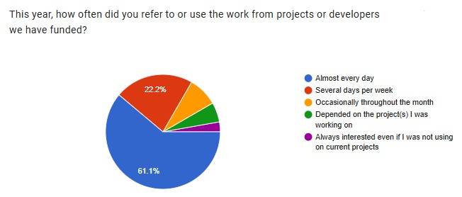

--
title: "Thanks..and more"
date: 2025-12-29T14:00:00+12:00
author: lvh, Maria, Daniel C., Heather, Lorelai, Daniel S., Christoph, Kathy
summary: $171,000 in project funding - 18 grants, 16 developers
draft: True  

---
As 2025 comes to a close we want to reach out and thank you for supporting Clojure, open-source, and the Clojurists Together community.  

#### We’ve been able to accomplish a lot this year with your support.  

In 2025, we funded a total of $171,000 of projects. 10 developers completed 12 shorter-term projects ($66,000 USD). 6 developers received a monthly stipend for the year ($105,000 USD in long-term funding). Since 2018, Clojurists Together has awarded more than $1.2 million to 87 developers working on more than 154 projects.  

Your input on our quarterly surveys is critical to ensuring that we are funding work that is needed, valued, and adopted by the community at large. 22% of members participate every quarter.  

30% of members participated in the process for selecting the developers to receive 2026 annual funding. Thank you for reviewing the proposals and voting!  

We appreciate your subscription to our regular news and updates dispatches - as we believe it encourages wider use of the tools and resources of the developers we have funded - strengthening and advancing the open-source and Clojure community. For those of you who subscribe but are not yet members, [you can always join the voting community for as little as $5 per month.](https://www.clojuriststogether.org/developers/). For those of you who are already members, even a small increase in membership contributions could enable us to fund more projects. Every little bit helps. 

We were able to attend the Heart of Clojure/Conj conference in the U.S. in November - and it was great to see and share with so many of you in person!

 
#### The developer’s work we fund is highly valued - and used daily.  

In addition to requesting specific tools and improvements, we have heard a consistent call for better documentation (content, presentation, and organization) and more support for engaging and supporting new Clojure users. This year, we received and funded several proposals that focused on these needs and will continue to encourage work in these areas. It is great to see that so many of you refer to and rely on the work the developers have undertaken throughout the year.  

 

 

#### Short-Term Projects Funded in 2025  

**Q2 2025:**   Bling, CALVA, CIDER, Code Combat, Jank, and Scicloj Building Bridges

**Q3 2025:** Fastmath, Fireworks, Jank, Malli, Uncomplicate Clojure ML, and Uix  

**2025 developers receiving annual funding:** Michiel Borkent, Eric Dallo, Dragan Djuric,  Peter Taoussanis, Oleksandr Yakushev, and Toby Crawley (Clojars maintenance and support).  
 

#### Fun Facts and Thank You's  
We are truly an international group bringing a wide range of experience. From Q1 2022 to Q3 2025, we funded developers working in 22 countries including Austria, Belgium, Brazil, Bulgaria, Canada, Denmark, England, Finland, France, Germany, Israel, Lithuania, Netherlands, Norway, Poland, Serbia, South Korea, Spain, Sweden, Ukraine, UK and the US.  

**This staggering amount of work has benefited our members and the broader Clojurist community.**  
 A thanks goes out to all the developers for their commitment and contributions to the community over the last 8 years: Adam Helins, Alexander Oloo, Ambrose Bonnaire-Sergeant, Arne Brasseur, Ashima Panjwani, Baptiste Dupuch, Benjamin Kamphaus, Ben Brinckerhoff, Bobbi Tower, Bozhidar Batsov, Brandon Ringe, Bruce Hauman, Chris Badahdah, Chris McCormick, Charles Comstock, Chris Oakman, Christian Johansen, Christophe Grand, Dainius Jocas, Daniel Higginbotham, Daniel Slutsky,Danny Freeman, David Levy, David Nolen, Dragan Duric, Eric Dallo, Ethan Miller, Gert Goet, Grodziski, Henry Widd, Iizuka Masashi, Isaac Johnston, Jack Rusher, Jacob O’Bryant, James Reeves, Janet Carr, Jeaye Wilkerson, Jeremiah Coyle, John Collins, John Stevenson, Joakim Tengstrand, Joel Holdbrooks, José Luis Lafuente, Juho Teperi, Karl Pietrzak, Karol Wójcik, Kira McLean, Konrad Kühne, Kury Harringer, L. Jordan Miller, Lee Hinman, Lukas Domagala, Mark Engelberg, Martin Kavalar, Matthew Davidson, Matthew Huebert, Matthew Ratzke, Michael Sappler, Michiel Borkent, Mike Fikes, Mitesh Shah, Nikita Prokopov, Oleksandr Yakushev, Oleksii Kachaiev, Oliver Caldwell, Othman Azil, Peter Stromberg, Peter Taoussanis, Rafael Krzyważnia, Roman Luitikou, Sam Ritchie, Savo Djuric, Sean Corfield, Sebastian Zartner, Siyoung Byun, Thomas Clark, Thomas Heller, Tim Pope, Toby Crawley, Tommi Jalkanen, Tommi Reiman, VEMV, Vladislav Protsenko, William Acton, Zach Oakes, Žygis Medelis, and the team at Gaiwan.  

Finally, a shout-out to the companies and organizations who have supported our work throughout the year and most for many years. They believe in Open Source development and have made a commitment to Clojure as an important tool for their product, service, and organizational projects. If your company might consider becoming a sponsoring member, please contact Daniel Compton at daniel@clojuriststogether.org to explore further.   

slide of tranduce, map etc  

**And a shout out to the Into, Cons and Assoc Members who Contributed in 2025!**  
bevuta IT GmbH, Jepsen, Xcoo, Sharetribe, Basil, Cognician, Biotz SL, Matrix Operations, Strategic Blue, Eric Normand, Nubizzi, Oiiku, Singlewire Software,Tentekraft, Bloom Ventures, Mastodon C, Ardoq AS, Condense, Mediquest, Vane GmbH, Codesmith GmbH, ELiT Ltd. Thorax informatieprojecten & advies, Fincite Management BV, Joshua Miller and Revenue Share member Jacek Schae (Learn Reagent, Learn re-frame).    

**... and another thank you to all the 2025 Contributing Members.** [All of you make this work possible!](https://www.clojuriststogether.org/members/)  

Let’s join in celebrating this wonderful community - and hoping for peace in the New Year.   
lvh, Maria, Daniel C, Heather, Lorelai, Daniel S., Chrisoph (Clojurists Together Board), and Kathy (Program Manager).  